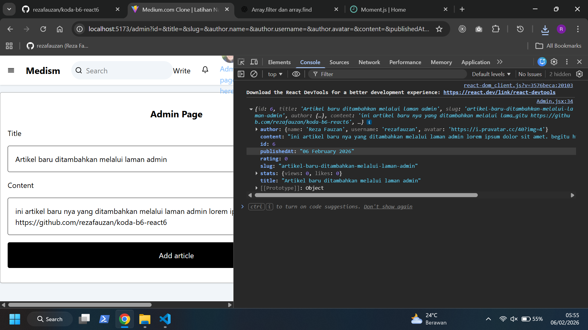
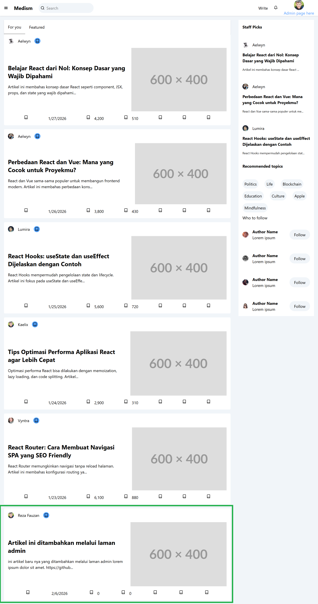
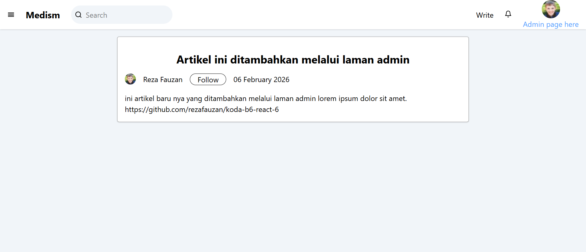

# Medium Clone React App
merupakan project aplikasi web kloning dari Medium.com yang dibangun menggunakan React.js. Aplikasi ini memungkinkan pengguna untuk membaca artikel yang di dapat dari hasil fetch 

## Home Page Screenshot

## Article Page Screenshot

## Admin Page Screenshot

## Home Page After New Article Added

## New Article Page Screenshot

## How to run it
- Download source code
- npm install
- npm run dev
- open https://localhost:5173